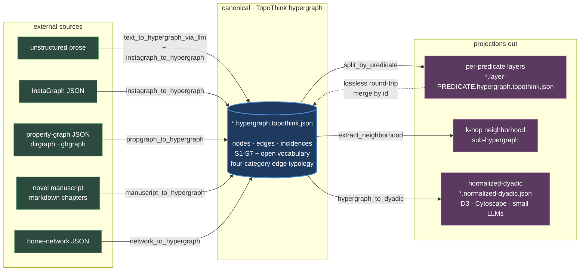

# information2topology (i2t)

A method and toolchain for turning prose, code repositories, networks — anything with relations in it — into navigable **hypergraphs**. The bet is that information has *substrate-independent structure* (the same shape recurs across Hilbert spaces, social graphs, codebases, philosophical arguments) and that surfacing that structure faithfully — without imposing a vocabulary — is the prerequisite for everything built on top.

The engineering arm of *TopoThink: Reclaiming Intuition*.
Peer-review whitepaper: [`docs/information-to-topology-whitepaper.md`](docs/information-to-topology-whitepaper.md) (v1.2.0, 2026-05-22).

---

## What we do, in one chart

---

## 1. Explanation of project

Most knowledge-representation systems flatten complex relations into dyadic pairs because that's what tools and databases force. That flattening is a **transduction tax**: a multi-party relation (a chemical reaction, a marriage, a meeting, a philosophical claim with three premises) gets split into a tangle of pairwise approximations and its unity is lost.

i2t resists that. The internal lingua franca is a **hypergraph in the mathematical sense** — edges can connect any number of nodes — extended for federation and reification. Everything outside that format is reached by **adapters**: ingest adapters write it, transform adapters re-project it, emitters convert it for external consumers.

**Two non-negotiable commitments:**

1. **Faithfulness to source topology.** Don't flatten cycles, n-ary relations, or first-class edges into trees for ergonomic reasons. *Legible nonsense* is the failure mode.
2. **Edge-first ontology.** Relations are first-class ontological citizens, not properties of the nodes they connect. JSON-as-default trains the opposite intuition (tree-prior, child-belongs-to-parent) and is corrosive.

The whitepaper formalizes a third commitment — the **evidence-interpretation firebreak** — that runs through the extraction prompt and the editorial-discipline convention: edges *report* (cite a text excerpt from the source); incidences *interpret* (roles describe participation).

---

## 2. Schema for hypergraph

| File | Role |
|---|---|
| [`hypergraph.topothink.spec.md`](hypergraph.topothink.spec.md) | Normative prose specification |
| [`hypergraph.topothink.schema.json`](hypergraph.topothink.schema.json) | Structural-only JSON Schema (validatable) |
| [`docs/edge-categories.md`](docs/edge-categories.md) | Four-category edge typology (companion, normative) |

### Structural rules (closed — these MUST hold)

| Rule | Means |
|---|---|
| **S1** | Three primitive types only: **nodes · edges · incidences**. No nested children. |
| **S2** | Every node has a globally unique `id`. URIs / URNs / content hashes recommended. |
| **S3** | Edge ↔ node connections live in the `incidences` list, not inline on the edge. |
| **S4** | All three primitives are reifiable (an edge id may also appear as a node id). |
| **S5** | Edges connect ≥1 nodes (unary, dyadic, or n-ary hyperedge). |
| **S6** | Direction is optional and per-edge (`directed: true` + source/target roles). |
| **S7** | Nodes / edges / incidences may carry arbitrary `attrs`. |

### Vocabulary rules (open)

Any attribute key is permitted. URI-prefixed keys (`schema:license`, `i2t:predicate`, `dcterms:creator`) are recommended for federability across files. Vocabulary collisions resolve at *ingest*, not at schema.

### Four-category edge typology

Every edge classifies into **exactly one** of these. The category drives visualization — each gets its own visual idiom — and is encoded in `attrs['i2t:edge_category']`.

| Category | What it asserts | Visual idiom | Example predicates |
|---|---|---|---|
| **containment** | Y encloses X along a named dimension (spatial, temporal, set-membership, type-hierarchy) | Nested regions, no line | `member_of`, `scene_contains`, `during`, `inside`, `subset_of` |
| **state change** | A transition over time from one state to another | Positional flow, gradient, motion | `causes`, `next_paragraph`, `transforms_into`, `supersedes` |
| **interactivity** | An active channel where something propagates (force, data, signal, communication) | Shared visual field, blend | `married_to`, `gravitates_toward`, `depends_on`, `speaks_to` |
| **reference** | Static pointer or comparative claim that doesn't transmit | Floating marker, low weight | `mentions`, `cites`, `analogous_to`, `older_than`, `is_about` |

**Decision procedure (first match wins):** transition over time → state change · enclosure → containment · channel → interactivity · default → reference.

**No reification of relations as entities** unless the source text itself treats them as entities. A marriage is one interactivity edge between two persons, not a Marriage node. Identity / `same_as` is a graph rewrite, not an edge — encoded separately.

---

## 3. Projection options

The canonical hypergraph is **one source of truth, many projections**. The viewer should treat layers as the loadable unit, not the whole hypergraph.

| Projection | Adapter | Use |
|---|---|---|
| **Per-predicate layers** | `split_by_predicate.py` | One hypergraph file per `i2t:predicate` value. The multilayer-network primitive. Lossless round-trip: merge any subset of layers by id and you recover the layered topology. |
| **K-hop neighborhood** | `extract_neighborhood.py` | Sub-hypergraph centered on anchor nodes. For slicing large graphs by relevance. |
| **Normalized dyadic** | `hypergraph_to_dyadic.py` | Flattened: every n-ary edge becomes an edge-as-node plus dyadic links to its members. Filterable by `layer` field. For visualization libraries and smaller LLMs. |
| **External graph formats** (JGF, D3, HIF) | (via dyadic) | Lossiness is a property of the target format, not a defect of the source — JGF drops arity ≠ 2; D3 keeps node-pair edges only. |

**Which file to give which AI** — see [`docs/ai-collaborator-format-guide.md`](docs/ai-collaborator-format-guide.md):

| Collaborator | Format |
|---|---|
| Claude / GPT-4 / large-context strong-schema models | `*.hypergraph.topothink.json` |
| Gemma 3/4, Llama, smaller open models (7B–30B) | `*.normalized-dyadic.json` |
| D3 / Cytoscape / Sigma / react-force-graph | `*.normalized-dyadic.json` |
| InstaGraph-native tooling | `*.instagraph.json` |

The split is about **indirection tolerance**, not capability ceiling.

---

## 4. Adapters, droid guides, flows, documentation

### Adapters — [`adapters/`](adapters/) · full docs in [`adapters/README.md`](adapters/README.md)

**Ingest (external → canonical):**

| Script | Reads | Writes |
|---|---|---|
| `text_to_hypergraph_via_llm.py` | Any prose | InstaGraph JSON via Claude (uses [`prompts/text_to_topothink_hypergraph.md`](prompts/text_to_topothink_hypergraph.md)) |
| `instagraph_to_hypergraph.py` | InstaGraph JSON (yoheinakajima schema + i2t extensions) | Canonical hypergraph |
| `propgraph_to_hypergraph.py` | Property-graph JSON (dirgraph / ghgraph shape) | Canonical hypergraph |
| `manuscript_to_hypergraph.py` | Novel manuscript (markdown chapters) | Canonical hypergraph (two-layer: paragraphs + entities) |
| `network_to_hypergraph.py` | Home-network JSON | Canonical hypergraph |

**Transform (canonical → canonical):**

| Script | Purpose |
|---|---|
| `split_by_predicate.py` | Decompose into per-predicate layer files |
| `extract_neighborhood.py` | K-hop sub-hypergraph around anchor nodes |

**Emit (canonical → external):**

| Script | Purpose |
|---|---|
| `hypergraph_to_dyadic.py` | Normalized-dyadic for viewers / small models |

### Prompts — [`prompts/`](prompts/)

- [`text_to_topothink_hypergraph.md`](prompts/text_to_topothink_hypergraph.md) — extraction prompt template. Editorial-discipline rules + Camus/Fanon worked examples. Paste into any reasoning-capable LLM if you don't want to run the API adapter.

### Droid flows — `~/ai/flows/`

- `i2t-hypergraph-schema-guide.md` / `.json` — droid-loadable schema guide; embeds the four edge categories so the flow is self-contained.

### Agent-to-agent correspondence — [`correspondence/`](correspondence/)

- [`json-visual-viewer.md`](correspondence/json-visual-viewer.md) — active coordination doc with the json-visual-viewer (JVV) project. Defines the NormalizedGraph schema and dispatch logic for graph-shaped JSON.

### Architectural research — [`research/`](research/)

| File | Role |
|---|---|
| `editorial-discipline.md` | **The architectural convention.** Edges report (cite evidence); incidences interpret (roles describe participation). Foundation for the extraction prompt and the evidence-interpretation firebreak. |
| `on-the-categories-of-relationship.md` | Derives the four-category edge typology from first principles. |
| `paragraph-as-nodes.md` | **Resolved (2026-04-29).** Two-layer architecture (paragraphs + entities). Implemented in `manuscript_to_hypergraph.py`. |
| `decomposition-rendering-and-whats-next.md` | Active working paper — hypergraph decomposition, rendering alternatives, the unbuilt hyperedge-native renderer. |

### Sample fixtures — [`data/`](data/)

Each public fixture comes in three forms: `.instagraph.json` (raw extraction) · `.hypergraph.topothink.json` (canonical) · `.normalized-dyadic.json` (viewer-ready).

| Fixture | Source | nodes / edges / incidences | Why it's here |
|---|---|---|---|
| `myth-of-sisyphus.*` | Camus, *The Myth of Sisyphus* | 52 / 82 / 164 | Cleanest baseline; no reification |
| `wretched-of-the-earth.*` | Fanon, *The Wretched of the Earth* | 82 / 111 / 240 | Reification + rich incidence attrs |
| `wizard-of-oz.*` | Baum, *The Wonderful Wizard of Oz* | 1,203 / 1,208 / 3,532 | Two-layer fixture (paragraphs + entities) with 3-act reified hyperedges |
| `tics-and-topology-conversation.*` | Meta-conversation about editorial discipline | 36 / 60 / 130 | Recursive existence proof — prompt-template path produces same shape as manual |

Layered fixtures live in [`data/layers/`](data/layers/) — 7 per-predicate layer files of `projects-merged`, demonstrating multilayer-network composability.

---

## 5. What is canonical

Treat the following as binding. They round-trip with each other and the spec.

- [`hypergraph.topothink.spec.md`](hypergraph.topothink.spec.md) + [`hypergraph.topothink.schema.json`](hypergraph.topothink.schema.json)
- [`docs/edge-categories.md`](docs/edge-categories.md) — four-category typology
- [`docs/information-to-topology-whitepaper.md`](docs/information-to-topology-whitepaper.md) — v1.2.0, peer review
- [`docs/ai-collaborator-format-guide.md`](docs/ai-collaborator-format-guide.md)
- [`adapters/`](adapters/) + [`adapters/README.md`](adapters/README.md) — every adapter listed in §4
- [`prompts/text_to_topothink_hypergraph.md`](prompts/text_to_topothink_hypergraph.md)
- [`correspondence/json-visual-viewer.md`](correspondence/json-visual-viewer.md)
- Public fixtures in [`data/`](data/): `myth-of-sisyphus`, `wretched-of-the-earth`, `wizard-of-oz`, `tics-and-topology-conversation`
- [`research/editorial-discipline.md`](research/editorial-discipline.md), [`research/on-the-categories-of-relationship.md`](research/on-the-categories-of-relationship.md), [`research/paragraph-as-nodes.md`](research/paragraph-as-nodes.md) (resolved), [`research/decomposition-rendering-and-whats-next.md`](research/decomposition-rendering-and-whats-next.md) (active)

---

## 6. What is not canonical (yet, or any more)

Worth keeping; not binding.

**Wild hairs / explorations** — interesting threads to pick up later, but don't treat as part of the spec:

- [`research/personal-droids-memory-graphs.md`](research/personal-droids-memory-graphs.md) — broader vision (R2D2-style agents with scoped persistent memory). Uses i2t as substrate; scopes beyond.
- [`research/topoviewer.md`](research/topoviewer.md) — spec sketch for an unbuilt hyperedge-native renderer. Flagged in the whitepaper as the next artifact.
- [`research/structural-primitives.md`](research/structural-primitives.md) — philosophical fragment.
- [`research/artificial-scarcity-at-scale.md`](research/artificial-scarcity-at-scale.md) — critique of AI-generated language texture; adjacent to i2t.
- [`research/EL30 - Graph.md`](research/EL30%20-%20Graph.md) — broader connectivist framing.
- [`research/graph-analytics-libraries.md`](research/graph-analytics-libraries.md) — narrow tech-decision doc.
- [`research/serialization-and-viewer-scaling.md`](research/serialization-and-viewer-scaling.md) — dated technical resolution.
- `adapters/kcore_decomposition.py` — analytical aside (annotates nodes with k-core number); not in main pipeline.

**Standalone case study** — useful reference, not the methodology:

- [`games/`](games/) + the long top-level `Topological and Architectural Analysis of Open-Source First-Person Game Repositories…md` — architectural analysis of open-source FPS engines. Domain-specific.

**Archived (superseded):**

- `docs/old/information-to-topology-whitepaper.v1.1.0.md` — previous whitepaper version.

**Incomplete / abandoned:**

- `videogametopology.json` — partial sketch.
- `research/seeds/` — empty placeholder.

**Loose-end notes / fragments worth keeping but not load-bearing:**

- [`quotes.md`](quotes.md) — design-philosophy fragments on dyadic rendering, hyperedges, wu-wei in visual art.

---

## Vocabulary discipline (a reminder)

Three words this project reserves; never use them metaphorically or as synonyms.

- **substrate** — the medium being transcended (filesystem, GitHub, JSON, RDF, language). Substrate-*independence* is the thesis. Never use "substrate" to name a file format or schema.
- **topology** — the mathematical relation of which-things-are-connected (neighborhoods, continuity, connectedness). Not a synonym for "shape" or "layout."
- **information** — the substrate-independent structure being surfaced. Not "data" (encoded form), not "content" (specific values).

When introducing a project-specific term, qualify with `topothink` (e.g. `hypergraph.topothink.json`) so the base term tells you what kind of object it is in the wider world and the qualifier signals the i2t-specific extension.
